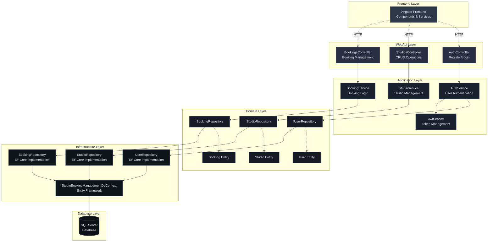

# Studio Booking Management - Backend Architecture

## Architecture Diagram



## 🏗️ Architecture Overview

Your Studio Booking Management system follows a **Clean Architecture** pattern with clear separation of concerns across four main layers.

### 📋 Architecture Layers

#### 1. **WebApi Layer (Presentation)**
- **Controllers**: `AuthController`, `StudiosController`, `BookingsController`
- **Configuration**: JWT authentication, CORS setup, dependency injection
- **Middleware**: Authentication, authorization, and cross-origin handling

#### 2. **Application Layer (Use Cases)**
- **Services**: Business logic implementations (`AuthService`, `StudioService`, `BookingService`)
- **Interfaces**: Service contracts defining business operations
- **DTOs**: Data transfer objects for API communication
- **JWT Service Interface**: Token management abstraction

#### 3. **Domain Layer (Business Logic)**
- **Entities**: Core business objects (`User`, `Studio`, `Booking`) with business rules
- **Value Objects**: `Email` with validation logic
- **Repository Interfaces**: Data access contracts
- **Base Entity**: Common properties (Id, timestamps)

#### 4. **Infrastructure Layer (Data & External Services)**
- **Repository Implementations**: Data access logic with EF Core
- **DbContext**: Entity Framework configuration and mappings
- **JWT Service**: Token generation and validation
- **Migrations**: Database schema evolution

### 🔄 Key Architectural Benefits

1. **Dependency Inversion**: Dependencies flow inward toward the domain
2. **Testability**: Each layer can be unit tested independently
3. **Maintainability**: Clear separation makes changes easier
4. **Scalability**: Layers can be scaled independently
5. **Technology Independence**: Business logic is isolated from frameworks

### 🗄️ Database Design

- **Users Table**: Authentication and user profile data
- **Studios Table**: Studio information with location and pricing
- **Bookings Table**: Booking records with time slots and status tracking

### 🔐 Security Features

- JWT-based authentication
- Password hashing with BCrypt
- Email validation through value objects
- Role-based authorization setup

### 📊 Project Structure

```
StudioBookingManagement/
├── StudioBookingManagement.WebApi/          # Presentation Layer
│   ├── Controllers/                         # API Controllers
│   ├── Program.cs                          # App configuration
│   └── appsettings.json                    # Configuration
├── StudioBookingManagement.Application/     # Application Layer
│   ├── Services/                           # Business services
│   ├── Interfaces/                         # Service contracts
│   └── DTOs/                              # Data transfer objects
├── StudioBookingManagement.Domain/          # Domain Layer
│   ├── Entities/                           # Core business entities
│   ├── Repositories/                       # Repository interfaces
│   ├── ValueObjects/                       # Value objects
│   └── Common/                            # Shared domain logic
└── StudioBookingManagement.Infrastructure/  # Infrastructure Layer
    ├── Repositories/                       # Repository implementations
    ├── Data/                              # DbContext
    ├── Services/                          # External services
    └── Migrations/                        # Database migrations
```

This architecture ensures your application is maintainable, testable, and follows SOLID principles while providing a robust foundation for the studio booking management system.